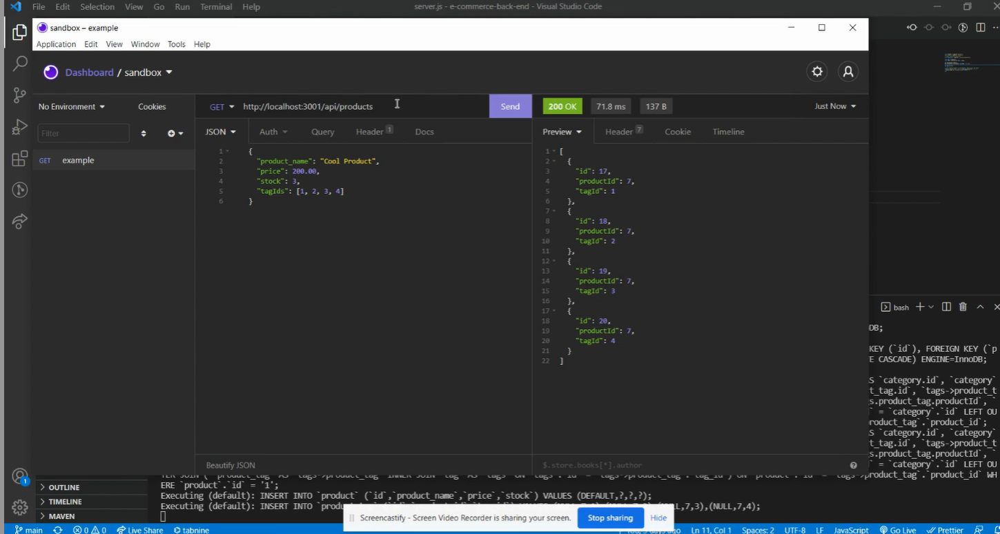

# E-Commerce-Backend
  [](https://opensource.org/licenses/MPL-2.0)

  ## Description:
  ___
  A server and database backend with routes including GET, POST, PUT, and DELETE

  ## Table of Contents:
  ___
  1) [Description](#description)
  2) [Installation](#installation)
  3) [Usage](#usage)
  4) [Video](#video)
  5) [Collaboration](#collaboration)
  6) [Tests](#tests)
  7) [Questions?](#questions?)
  8) [GitHub](#gitHub)
  9) [License](#license)

  ## Installation
  ___
  clone repository, create a .env file mirroring the EXAMPLE file, and run ```npm start```

  ## Usage
  ___
  used for managing products, categories for those products, as well as tags that associate with those products. It is used for adding, changing, and deleting information from an SQL database.

  ## Video
  ___
  [](https://drive.google.com/file/d/1T7zJwEFimH-iw5WUfxH9lfw-8ai9DcCG/view "Demo Video")

  ## Collaboration:
  ___
  For now, just follow the [Contributor Covenant](https://www.contributor-covenant.org/)

  ## Tests
  ___
  none yet

  ## Questions?
  ___
  Please contact me at:
  My [GitHub](https://github.com/Windowmac)
  
  Or Email:
  <mckendree.strommer@gmail.com>

  
  ## License: 
  ___
  Licensed under [Mozilla Public License 2.0](https://opensource.org/licenses/MPL-2.0)